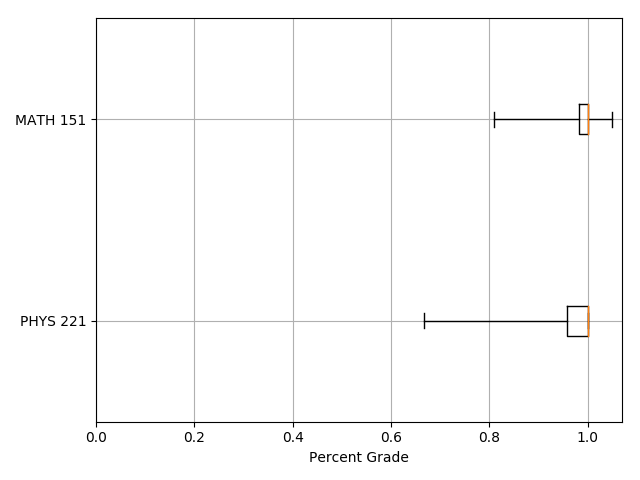

# Grade Statistics

## Overview

This program computes statistics for grades received in a set of courses. It expects CSV input with each row of the file containing a course code and a list of grades. The program will generate a table containing a five-number summary for each course as well as a graphic containing a box plot for each course.

```csv
Course,Grades
MATH 151,"0.95,1,1,1,1,1,1,1,0.96,0.99,1.05,0.81"
PHYS 221,"0.9423,1,0.9231,0.9583,0.9583,1,0.9464,0.8262,0.958,0.9132,1,0.9702,0.9583,1,0.9592,0.9896,0.9681,1,1,1,1,1,1,0.875,1,1,1,1,1,1,1,1,1,0.975,1,1,1,0.9,1,1,1,0.8182,1,1,1,0.9706,1,0.8462,0.9167,0.6667,1,0.9091,1,1"
```

| Course Code | Minimum | First Quartile | Median | Third Quartile | Maximum |
| ----------- | ------- | -------------- | ------ | -------------- | ------- |
| MATH 151 | 0.81 | 0.9825 | 1 | 1 | 1.05 |
| PHYS 221 | 0.6667 | 0.9583 | 1 | 1 | 1 |



## Running the Program

The program requires the presence of matplotlib, numpy, and tabulate. These can be installed with pip.

```bash
$ virtualenv env
$ source env/bin/activate
(env)$ pip install -r requirements.txt
```

Two arguments are expected, one containing the name of the input file and the other for the graphics output.

```bash
(env)$ python grades.py --input_filename=grades.csv --output_filename=plots.png
```

Courses may also be whitelisted through repeated use of the ```--course_code_whitelist``` argument. Those courses not specified in the whitelist will be listed as "Redacted." The redacted courses are placed at the bottom of the list and their order is randomized.

```bash
(env)$ python grades.py --input_filename=grades.csv --output_filename=plots.png --course_code_whitelist="MATH 151"
```

| Course Code | Minimum | First Quartile | Median | Third Quartile | Maximum |
| ----------- | ------- | -------------- | ------ | -------------- | ------- |
| MATH 151 | 0.81 | 0.9825 | 1 | 1 | 1.05 |
| Redacted | 0.6667 | 0.9583 | 1 | 1 | 1 |


